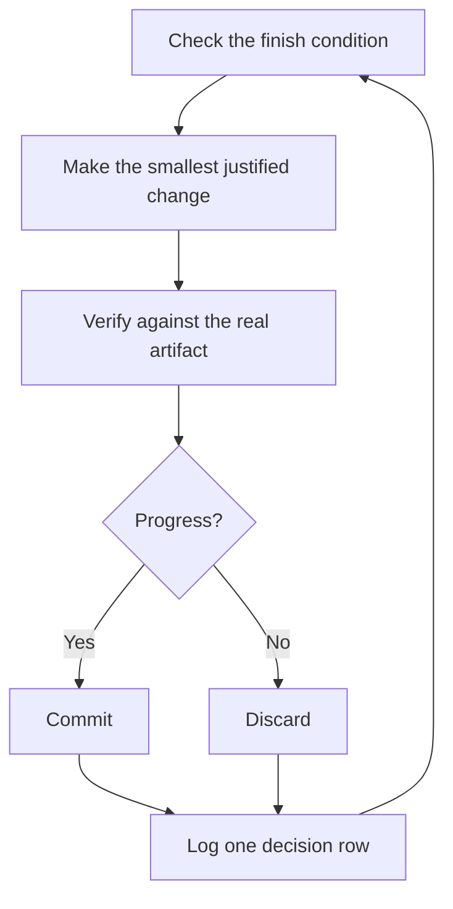

# Audit a local run

A run you can trust has a checkable finish condition, an isolated worktree, and a decision log. Local children remain tied to their live Pi parent session; this package does not schedule wakeups or keep workers alive after the parent exits.

## Define the task

A good handoff has the goal, the finish condition, permissions, and an escape hatch. It doesn't need to be long:

```text
/poteto-mode migrate every caller to the new parser in a fresh worktree off <base>.
done means zero old callers, all parser fixtures pass, old api deleted.
keep a decision log. don't ask me before committing.
if you're truly stuck, stop and write up why.
```

- "done means..." turns the goal into checks every iteration can run.
- "fresh worktree off <base>" keeps writes from colliding with other work.
- "don't ask me before committing" states the permission for local commits, not publishing or merging.
- The escape hatch permits reporting a genuine dead end, not weakening the finish condition.

Large work routes through [figure-it-out](../../skills/figure-it-out/SKILL.md), which designs the run's phases before code and wires in the decision log.

## Iterate against evidence



One change, one check, one log row, every iteration. Changes that didn't help get discarded, not left to ride. A plateau means pivot, not stop, and the finish condition never quietly relaxes to declare victory.

## Audit the decisions

[show-me-your-work](../../skills/show-me-your-work/SKILL.md) makes the run reviewable. Each row records the time, phase, decision, reason, an evidence pointer, and the result, in a TSV at `decisions.tsv` (or `.audit/<task-slug>.tsv` when several runs share a directory). It stays local by default. Commit it when a reviewer needs the trail to trust the result.

Before handoff, a reviewer on a different model family reads the trail and this run's exact transcript. The reply ends with an Attention section listing what deserves scrutiny. Read that section first, then the log rows it points at. Missing transcript evidence is a gap, not a completed audit.

For a multi-phase change, the [Multi-phase plan playbook](../../skills/poteto-mode/playbooks/multi-phase-plan.md) retains explicit dependencies, ten live verification lanes, performance comparisons, independent audits, and operator review gates. Planning does not authorize execution or landing.

**Pitfall:** a duration is not a finish condition. "work on this for 4 hours" gives the agent nothing to check. Give a predicate that can pass or fail.

Next: [Steer with principle names](./08-principles.md).
